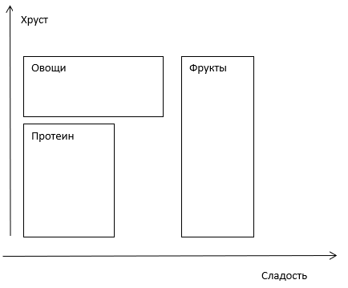
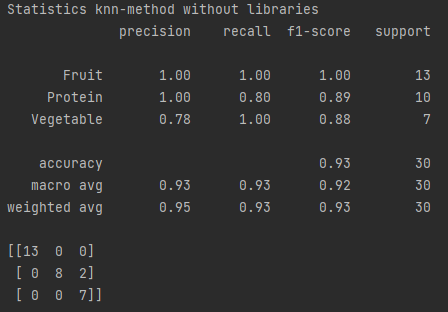
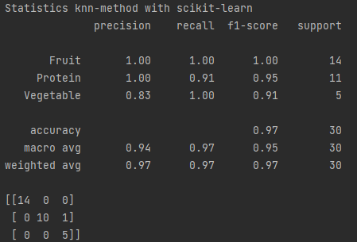
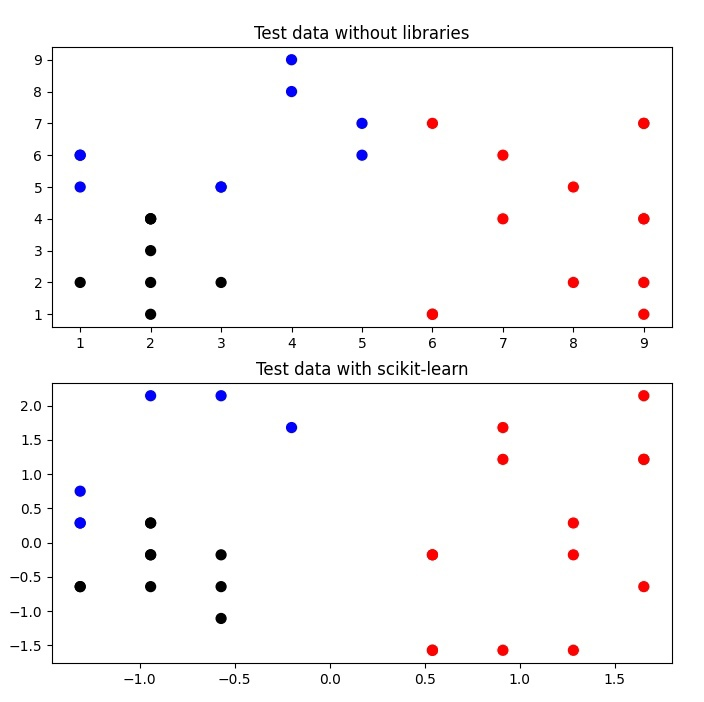
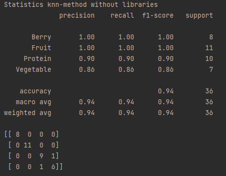
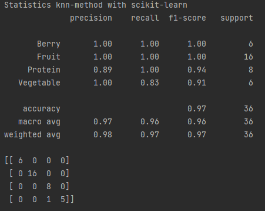
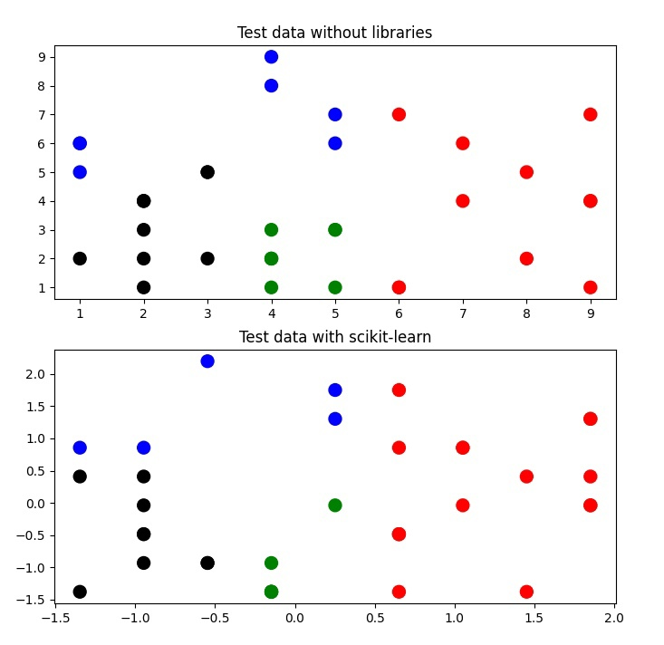

# Лабораторная работа №4

## Классификация. Метод k - ближайших соседей (k-NN)
1. Создать симулированный набор данных и записать его на диск в виде csv файла со следующими параметрами:
- продукт;
- сладость;
- хруст;
- класс. 

| Продукт  | Сладость | Хруст |  Класс  |
|:--------:|:--------:|:-----:|:-------:|
|  Яблоко  |    7     |   7   |  Фрукт  |
|  Салат   |    2     |   5   |  Овощ   |
|  Бекон   |    1     |   2   | Протеин |
|  Банан   |    9     |   1   |  Фрукт  |
|  Орехи   |    1     |   5   | Протеин |
|   Рыба   |    1     |   1   | Протеин |
|   Сыр    |    1     |   1   | Протеин |
| Виноград |    8     |   1   |  Фрукт  |
| Морковь  |    2     |   8   |  Овощ   |
| Апельсин |    6     |   1   |  Фрукт  |

Подготовить для классификации несколько примеров в соответствии с рисунком

2. Запрограммировать метрический классификатор по методу k-NN. 
Для проверки решить ту же задачу методом k-NN библиотеки sklearn.

3. Прочитать сгенерированный набор данных. 
Настроить классификатор. 
Провести эксперимент по классификации с контролем для подготовленных примеров. 

4. По возможности результаты визуализировать.

5. Ввести в набор данных и примеры продукты еще одного класса (возможно изменив набор параметров) 
и повторить эксперимент.

6. По результатам эксперимента подготовить отчет по лабораторной работе. 

## Отчет по лабораторной работе

### Метод ближайших соседей (кNN - k-Nearest Neighbours)
Метод ближайших соседей (kNN - k-Nearest Neighbours) - метод решения задач классификации и задач регрессии, 
основанный на поиске ближайших объектов с известными значения целевой переменной.

Метод основан на предположении о том, что близким объектам в признаковом пространстве соответствуют похожие метки.

Для нового объекта x метод предполагает найти ближайшие к нему объекты x1, x2, xn и построить прогноз по их меткам.

### Классификационный отчет

Предоставлены классификационный отчет и матрица ошибок.
1. Классификационный отчет - это один из показателей оценки эффективности модели машинного обучения на основе классификации. 
Он отображает точность вашей модели, отзывчивость, оценку F1 и поддержку.  И дает лучшее понимание общей производительности нашей обученной модели.
Показатели описаны ниже.

| Метрика              | Определение                                                                                                                                                      |
|:---------------------|:-----------------------------------------------------------------------------------------------------------------------------------------------------------------|
| Precision (Точность) | Точность определяется как отношение истинно положительных  результатов к сумме истинных и ложных срабатываний.                                               | 
| Recall (Напоминание) | Напоминание определяется как отношение истинных положительных  результатов к сумме истинно положительных и ложно отрицательных результатов. es.              | 
| f1-score (Оценка F1) | F1 – это взвешенное среднее гармоническое значение точности и напоминания. Чем ближе значение показателя F1 к 1.0, тем выше ожидаемая производительность модели. |
| Support (Поддержка)  | Поддержка – это количество фактических вхождений класса в набор данных. Она не отличается у моделей, она просто диагностирует процесс оценки эффективности.      | 

2. Матрица ошибок – это измерение производительности для классификации машинного обучения.
Значения диагонали сверху-вниз, слева-направо – это число верно предсказанных значений.
Другие значения будут ложноположительными или ложноотрицательными.

#### Первый эксперимент
В первом эксперименте используется три класса: fruit, protein, vegetable.
1. Алгоритм без использования библиотеки scikit-learn 

2. Алгоритм с использованием библиотеки scikit-learn 

3. Визуализация тестовых данных 

#### Второй эксперимент
Во втором эксперименте добавили ещё один класс. 
Значит используется четыре класса: berry, fruit, protein, vegetable.
1. Алгоритм без использования библиотеки scikit-learn 

2. Алгоритм с использованием библиотеки scikit-learn 

3. Визуализация тестовых данных 
