# Лабораторная работа №5

## Исследование инструментов классификации библиотеки Scikit-learn 

1. Ознакомиться с классификаторами библиотеки Scikit-learn
2. Выбрать для исследования не менее 3 классификаторов
3. Выбрать набор данных для задач классификации из открытых источников: 
https://tproger.ru/translations/the-best-datasets-for-machine-learning-and-data-science/  
https://vc.ru/ml/150241-15-proektov-dlya-razvitiya-navykov-raboty-s-mashinnym-obucheniem  
https://archive.ics.uci.edu/ml/index.php  
https://habr.com/ru/company/edison/blog/480408/  
https://www.kaggle.com/datasets/  
учебные наборы библиотеки Scikit-learn
4. Выбор классификаторов и набора данных утвердить у преподавателя (не должно быть полного совпадения с выбором другого студента)
5. Для каждого классификатора определить целевой столбец и набор признаков. .
6. Подготовить данные к обучению.
7. Провести обучение и оценку моделей на сырых данных.
8. Провести предобработку данных.
9. Провести обучение и оценку моделей на очищенных данных.
10. Проанализировать результаты.
11. Результаты анализа представить в табличной и графической форме.
12. Сформулировать выводы.
13. Оформить отчет по л/р.
14. Защитить результаты работы. 

## Отчет по лабораторной работе

1. Для исследования выбрано четыре классификатора: метод k-ближайших соседей, метод опорных векторов (модель SVK), 
классификатор дерева решений, наивный байесовский метод (Гауссовский байесовский классификатор).
   - **Метод ближайших соседей (kNN - k-Nearest Neighbours)** - метод решения задач классификации и задач регрессии, 
     основанный на поиске ближайших объектов с известными значения целевой переменной. 
     Метод основан на предположении о том, что близким объектам в признаковом пространстве соответствуют похожие метки.
   - **Метод опорных векторов (SVM)** - это линейный алгоритм используемый в задачах классификации и регрессии. 
     Данный алгоритм имеет широкое применение на практике и может решать как линейные, так и нелинейные задачи. 
     Суть работы проста: алгоритм создает линию или гиперплоскость, которая разделяет данные на классы.
   - **Классификатор дерева решений (Decision Tree Classifier)** - логический алгоритм классификации, решающий задачи классификации и регрессии. 
     Представляет собой объединение логических условий в структуру дерева, состоящие из решающих правил вида «Если ..., то ...». 
     Правила автоматически генерируются в процессе обучения на обучающем множестве, 
     они формулируются практически на естественном языке деревья решений. 
     Цель состоит в том, чтобы создать модель, которая предсказывает значение целевой переменной, 
     изучая простые правила принятия решений, выведенные из характеристик данных. 
   - **Наивный байесовский классификатор (Naive Bayes)** — это алгоритм машинного обучения, предназначенный для 
     многоклассовой классификации данных с независимыми признаками. 
     За один проход вычисляется условная вероятность каждого признака, 
     затем применяется теорема Байеса для нахождения распределения вероятности наблюдений. 
     Алгоритм предполагает, что наличие какого-либо признака в классе не связано с наличием какого-либо другого признака.

2. В качестве данных выбран [wine-quality-dataset](https://www.kaggle.com/datasets/yasserh/wine-quality-dataset). Набор данных описывает количество различных химических веществ, 
присутствующих в вине, и их влияние на его качество.

3. Обучение происходит **по всем признакам**.

4. Для анализирования просмотрим **набор данных**.
<code>print(dataset.head())</code>   
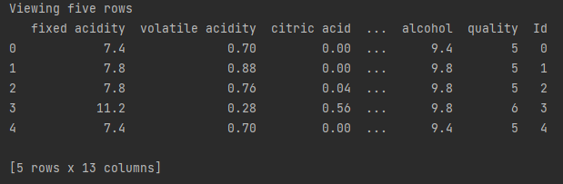
 

5. Выявим **размерность**.
<code>print('\nShape the DataSet : ', dataset.shape)</code>   
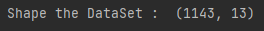
 

6. Вывод о том, понадобится ли **предобработка данных**.
<code>print(dataset.isnull().sum())</code>   
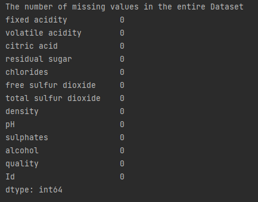 
Т.к. пустых значений нет, **предобработка данных не требуется**.
 

7. Выводим **описательную статистику**. 
**Функция describe ()** возвращает некоторые общие статистические данные данных, 
включая среднее значение, стандартное отклонение, минимальный элемент, максимальный элемент и некоторые другие детали
<code>print(dataset.describe().round(2))</code>   
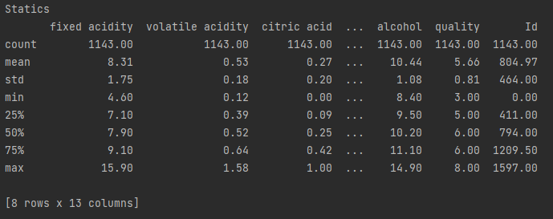
 

8. Выведем **уникальные значения признака**, в соответствии с которым и будет проходить классификация.
<code>print('\nThe value quality : ', dataset['quality'].unique())</code>   

 

9. Произведем группировку **по уникальным значениям признака** и выведем средние значения.
<code>print(dataset.groupby('quality').mean().round(2))</code>   
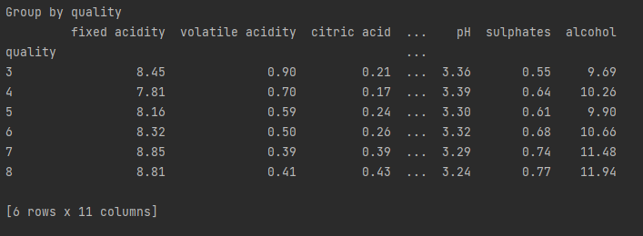
 

10. Анализ результатов.

    Выделено 5 типов качества вина от 3 до 8  
    - Лучшее качество вина - 8.  
    - Худшее качество вина - 3.  
    
    Элементы, оказывающие наибольшее влияние на качество вина:  
    - Alcohol (алкоголь)   
    - Free sulfur dioxide (Свободный диоксид серы, двуокись)  
    - Total sulfur dioxide (общий диоксид серы)  
    
    Элементы, оказывающие наименьшее влияние на качества вина:  
    - Fixed acidity  
    - Volatile acidity  
    - Citric acid  
    - Residual sugar  
    - Chlorides  
    - Density  
    - PH  
    - Sulphates
 

11. Сформируем наборы данных матрицы X и вектора y.  
<code>X = dataset.drop(columns='quality').values</code>  
<code>y = dataset['quality'].values</code>  

12. Разделим dataset на тренировочные и тестовые данные, а затем отобразим размерность массивов.
<code>X_train, X_test, y_train, y_test = train_test_split(X, y, test_size=0.3)</code>   
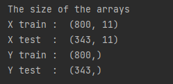
 

13. Рассмотрим эффективность _**метода ближайших соседей(k-NN)**_.  
Предоставим классификационный отчет, матрицу ошибок, метод оценки - score (показывает точность), 
метод оценки - accuracy score (показывает точность, то есть доля выборок, правильно спрогнозированных значений). 
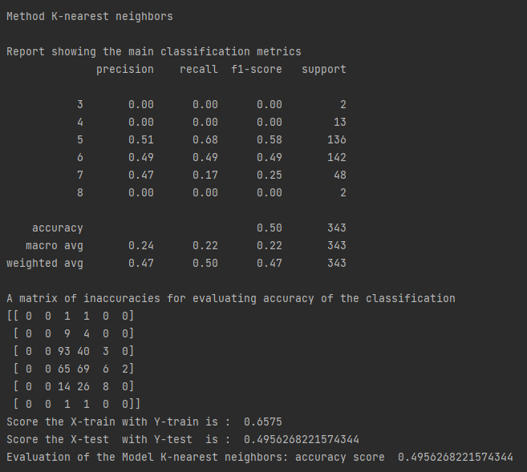
  
**Отображение результатов графически** 
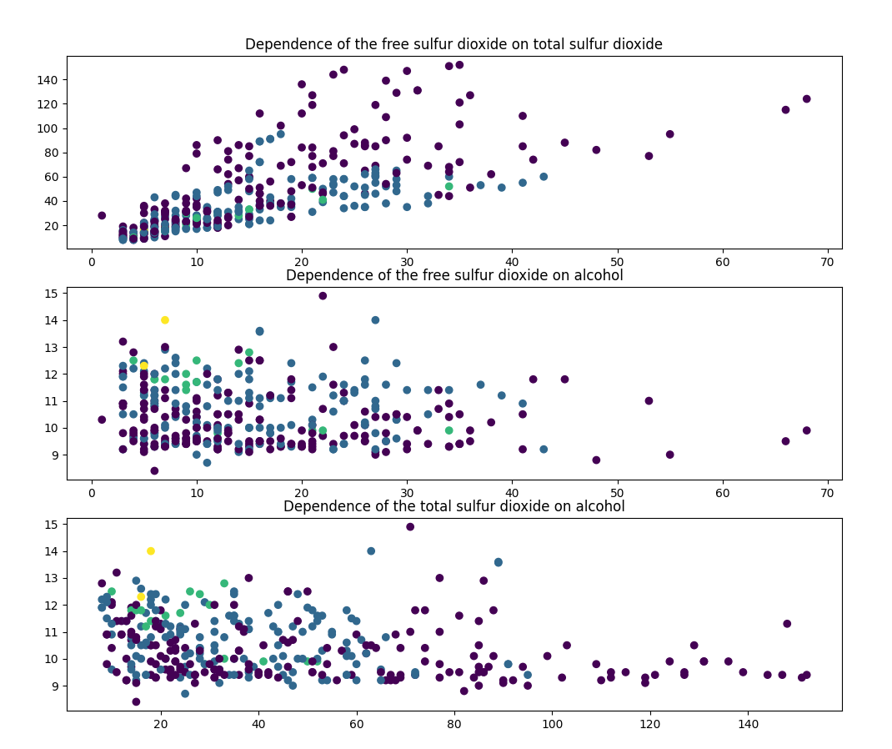
  
**Тестовые и прогнозируемые значения** 
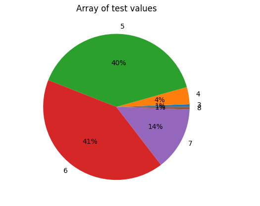 
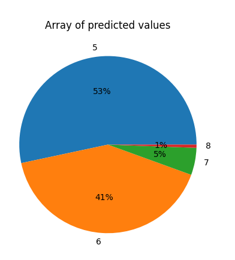 
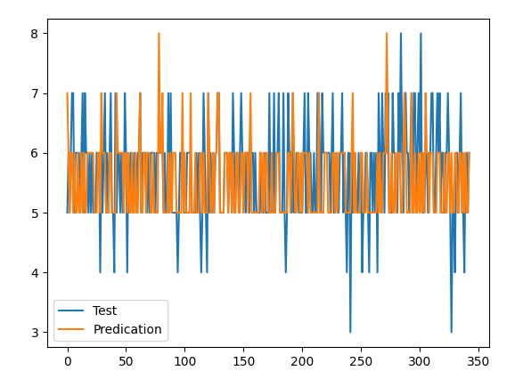
  
**Гистограмма зависимости данных от признака качество (quality)** 
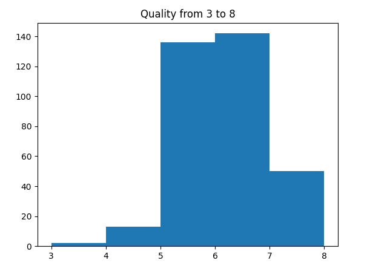
  

14. Рассмотрим эффективность _**метода опорных векторов (модель SVK)**_.  
Предоставим классификационный отчет, матрицу ошибок, метод оценки - score (показывает точность), 
метод оценки - accuracy score (показывает точность, то есть доля выборок, правильно спрогнозированных значений). 
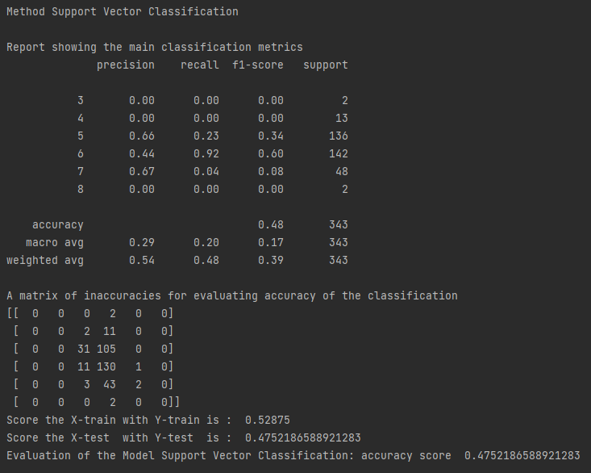
  
**Отображение результатов графически** 
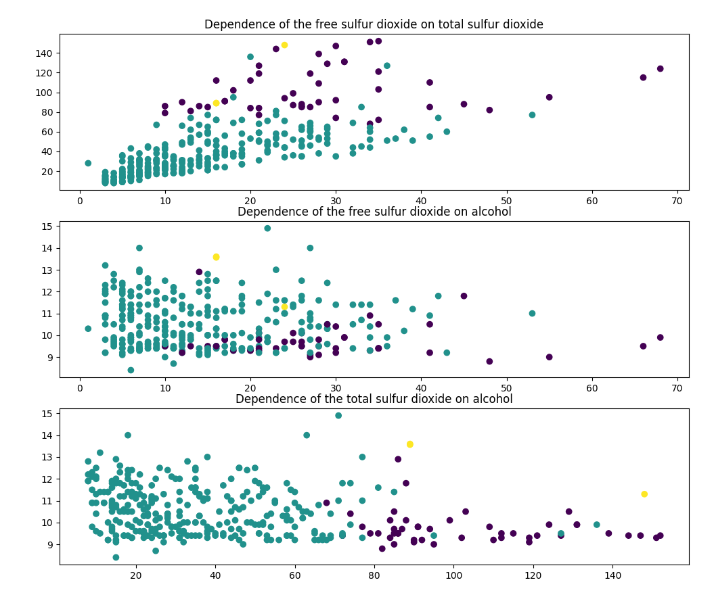
  
**Тестовые и прогнозируемые значения** 
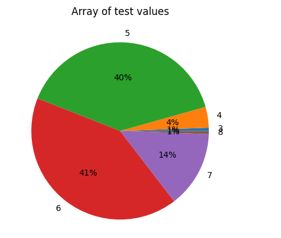 
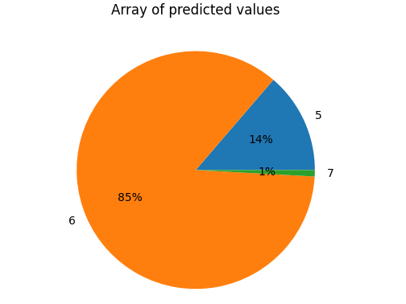 
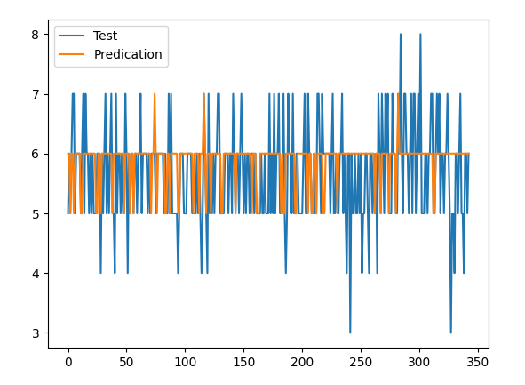
  
**Гистограмма зависимости данных от признака качество (quality)** 
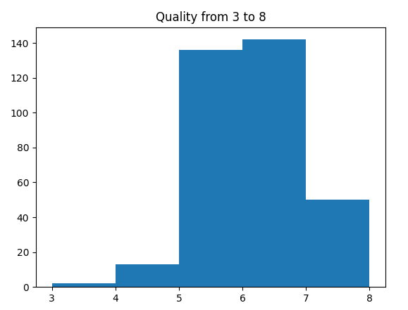
  

15. Рассмотрим эффективность _**классификатора дерева решений**_.  
Предоставим классификационный отчет, матрицу ошибок, метод оценки - score (показывает точность), 
метод оценки - accuracy score (показывает точность, то есть доля выборок, правильно спрогнозированных значений). 
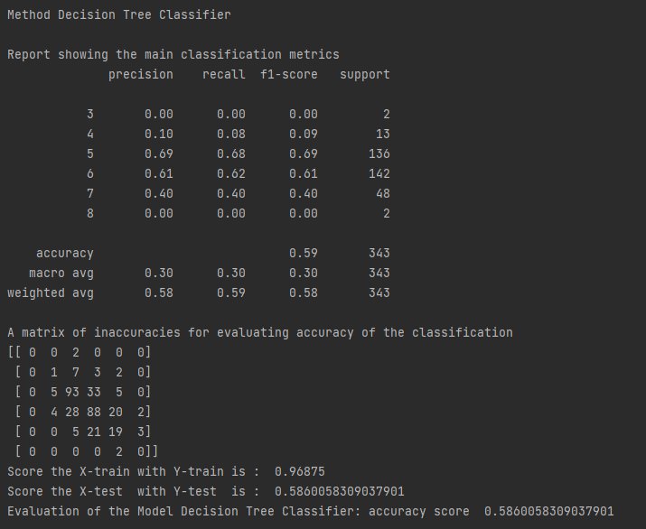
  
**Отображение результатов графически** 
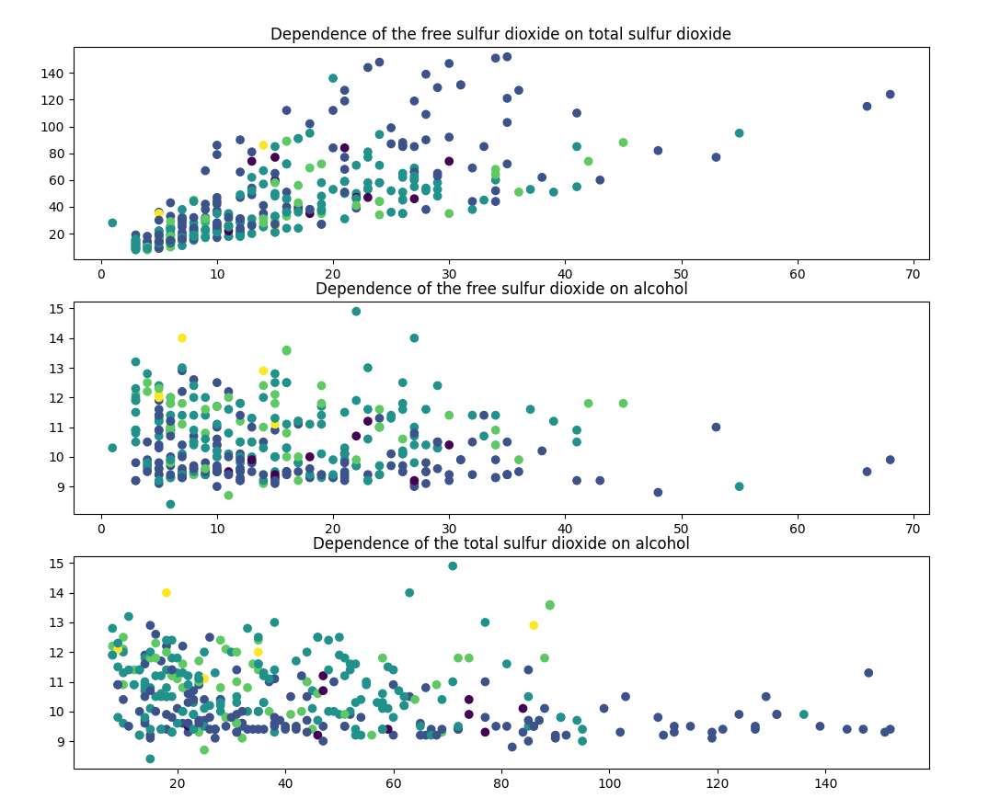
  
**Тестовые и прогнозируемые значения** 
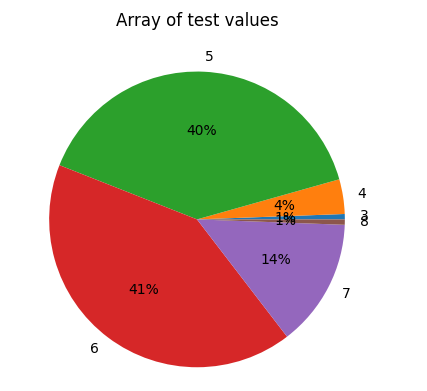 
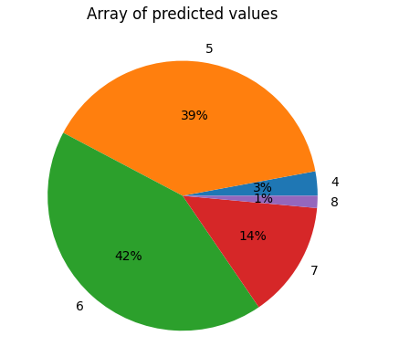 
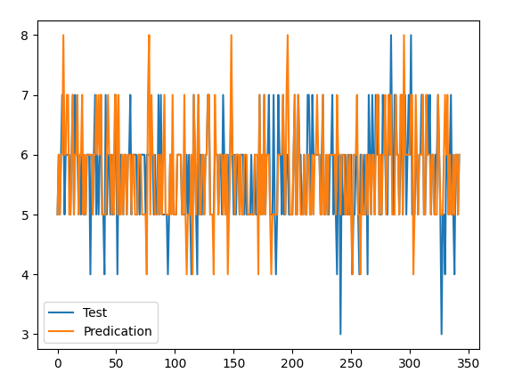
  
**Гистограмма зависимости данных от признака качества (quality)** 
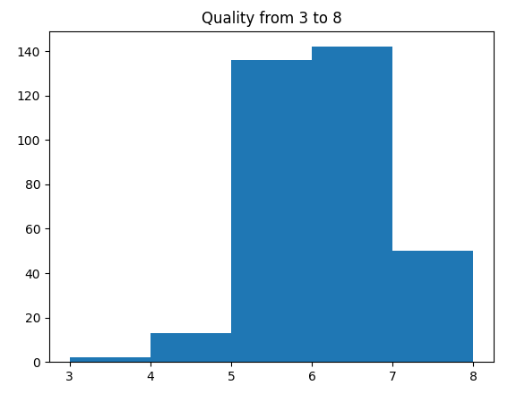
  

16. Рассмотрим эффективность _**наивного байесовского метода (рассматривается гауссовский байесовский классификатор)**_.  
Предоставим классификационный отчет, матрицу ошибок, метод оценки - score (показывает точность), 
метод оценки - accuracy score (показывает точность, то есть доля выборок, правильно спрогнозированных значений). 
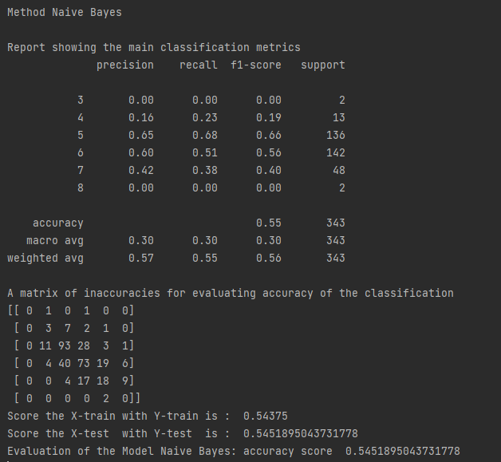
  
**Отображение результатов графически**  
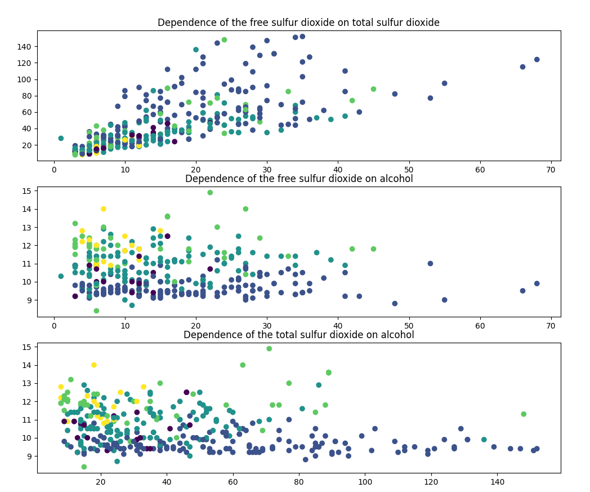
  
**Тестовые и прогнозируемые значения** 
 
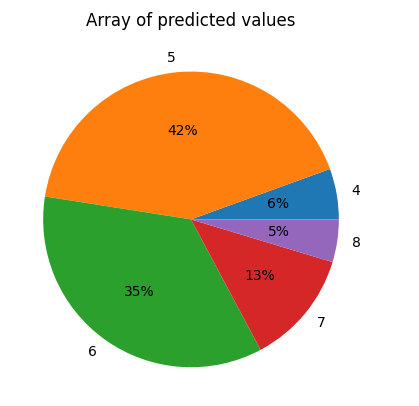 
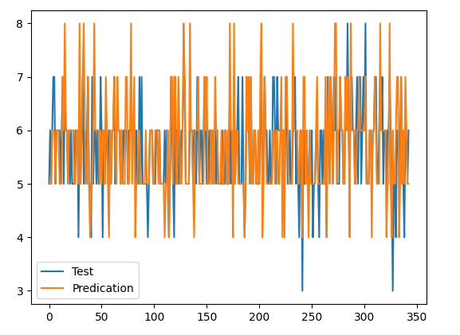
  
**Гистограмма зависимости данных от признака качества (quality)** 
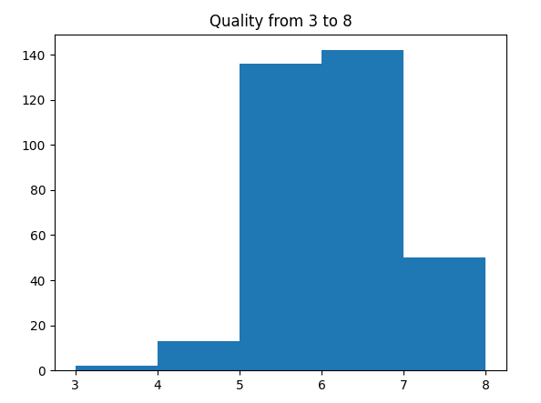
  

17. Результаты.

| Метод классификации               | Score train  | Score test         | Accuracy score       |
|:----------------------------------|:-------------|:-------------------|:---------------------|
| **K-nearest neighbors**           | 0.6575       | 0.4956268221574344 | 0.4956268221574344   |
| **Support Vector Classification** | 0.52875      | 0.4752186588921283 | 0.4752186588921283   |
| **Decision Tree Classifier**      | 0.96875      | 0.5860058309037901 | 0.5860058309037901   |
| **Naive Bayes**                   | 0.54375      | 0.5451895043731778 | 0.5451895043731778   |
